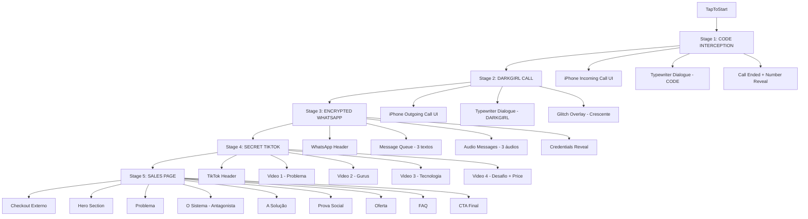

# PROJECT INVISIBLE — UI/UX Specification

**Versão:** 1.0
**Data:** 2026-03-05
**Autor:** UX Expert — Synkra AIOS
**Status:** Aprovado para Arquitetura Frontend

---

## Change Log

| Data | Versão | Descrição | Autor |
|------|--------|-----------|-------|
| 2026-03-05 | 1.0 | Criação inicial da especificação UX/UI | UX Expert |

---

## 1. Introdução

Este documento define os objetivos de experiência do usuário, arquitetura de informação, fluxos de usuário e especificações de design visual para o PROJECT INVISIBLE. Serve como fundação para desenvolvimento frontend, garantindo uma experiência coesa, cinematográfica e psicologicamente eficaz.

O PROJECT INVISIBLE não é uma interface convencional — é uma experiência narrativa. Cada decisão de design deve reforçar a ilusão de que o usuário está vivenciando uma descoberta real, não consumindo marketing.

### Overall UX Goals & Principles

#### Target User Personas

**Persona Primária — O Criador Invisível:**
- Criador de conteúdo 25–35 anos, 1k–50k seguidores no Instagram
- Posta 5–7x por semana com consistência
- Já comprou pelo menos 1 curso de Instagram sem resultado significativo
- **Estado emocional ao entrar no funil:** frustração latente + esperança reduzida
- **O que precisa sentir:** "Finalmente alguém entende o meu problema"
- **Device:** 90%+ acessa por iPhone ou Android (não desktop)

**Persona Secundária — O Empreendedor Digital:**
- Pequeno negócio ou profissional liberal, 30–45 anos
- Usa Instagram como canal de aquisição principal
- **Estado emocional:** ceticismo sobre automação + pressão por resultado
- **O que precisa sentir:** lógica e segurança técnica (DarkGirl resolve isso)

#### Usability Goals

- **Imersão imediata:** usuário deve estar "dentro" da narrativa em menos de 10 segundos após Stage 1 iniciar
- **Zero fricção narrativa:** nenhum elemento de UI deve quebrar a ilusão de estar em um app nativo
- **Progressão inevitável:** cada estágio deve criar tanta curiosidade que o usuário não queira parar
- **Recuperação de abandono:** se o usuário sair e voltar (sessionStorage), retomar exatamente onde parou

#### Design Principles

1. **Realidade simulada acima de tudo** — A simulação de iOS call, WhatsApp e TikTok deve ser indistinguível do original em fidelidade visual. Se quebrar a ilusão, é um bug de design.
2. **Escuridão com propósito** — O preto não é estético, é narrativo. Representa o underground, o proibido, o que "o sistema" não quer que você veja.
3. **Verde como poder** — O hacker green (`#00FF41`) é usado exclusivamente para elementos de ação e revelação. Cada vez que aparece, algo importante está acontecendo.
4. **Movimento conta a história** — Cada animação tem motivação narrativa. Glitch = interferência. Typewriter = urgência. Fade = segurança. Pulse = vida.
5. **O silêncio também faz parte** — Pausas deliberadas entre diálogos criam tensão. Não encher cada segundo de informação.

---

## 2. Information Architecture

### Site Map / Screen Inventory



### Navigation Structure

**Navegação primária:** Não existe. O funil é linear e sequencial. Não há menu, back button, ou navegação lateral. O único movimento é "para frente".

**Navegação secundária:** Não existe no MVP.

**Estratégia de breadcrumb:** Nenhuma visível ao usuário. O `funnelStore` rastreia internamente para analytics.

**Escape valve:** Stage 5 (Sales Page) tem link de rodapé para Termos e Privacidade — único elemento de navegação secundária.

---

## 3. User Flows

### Flow Principal — Jornada Completa do Funil

**Objetivo do usuário:** Descobrir e adquirir o Conectagram sem perceber que está em um funil de vendas.

**Entry Points:** Link de tráfego pago (Facebook Ads, Instagram Ads, TikTok Ads) → URL do funil

**Success Criteria:** Usuário clica no CTA "Ativar Conectagram" no Stage 5 e chega ao checkout

```mermaid
graph TD
    A[Acessa URL do Funil] --> B[TapToStart Screen]
    B --> C{Tap para Iniciar}
    C -->|Toca| D[Audio Engine Unlocked]
    D --> E[Stage 1 - Ligação CODE]
    E --> F[Ouve/lê diálogo completo]
    F --> G{Chamada encerrada}
    G --> H[Número revelado na tela]
    H --> I{Toca em LIGAR}
    I --> J[Stage 2 - Ligação DarkGirl]
    J --> K[Ouve/lê diálogo DarkGirl]
    K --> L[Glitch aumenta]
    L --> M[Interferência + dissolve]
    M --> N[Stage 3 - WhatsApp]
    N --> O[Recebe mensagens em tempo real]
    O --> P[Ouve 3 mensagens de voz]
    P --> Q[Credenciais TikTok reveladas]
    Q --> R{Toca em ACESSAR}
    R --> S[Stage 4 - TikTok Feed]
    S --> T[Assiste vídeos 1-3]
    T --> U[Vídeo 4 - Price Reveal]
    U --> V{Toca em TESTAR AGORA}
    V --> W[Stage 5 - Sales Page]
    W --> X[Lê/scroll pela página]
    X --> Y{Clica CTA Final}
    Y --> Z[Checkout Externo]
```



**Edge Cases:**
- Usuário sai no meio de um stage → sessionStorage preserva progresso, volta ao mesmo ponto
- Áudio não funciona → Experiência continua apenas visual (texto do diálogo ainda aparece)
- Vídeos do Stage 4 não carregam → Thumbnail com ícone de play + mensagem de erro discreta
- iOS bloqueio de autoplay → TapToStart resolve antes do Stage 1

---

## 4. Wireframes & Mockups (ASCII)

### TapToStart Screen
```
┌──────────────────────────────┐
│                              │
│                              │
│                              │
│                              │
│         [LOGO/ÍCONE]         │
│                              │
│      ▶  TAP TO START         │
│     (pulsando em verde)      │
│                              │
│  "Ative o som para           │
│   experiência completa"      │
│                              │
│                              │
│                              │
│                              │
└──────────────────────────────┘
Background: #000000
Texto CTA: #00FF41 (Space Mono)
Texto secundário: rgba(255,255,255,0.6)
```

### Stage 1 — iPhone Incoming Call
```
┌──────────────────────────────┐
│ 09:41   ●●●●  WiFi    🔋    │ ← status bar simulada
├──────────────────────────────┤
│                              │
│      Chamada recebida        │
│                              │
│   ┌────────────────────┐    │
│   │    👤              │    │
│   │   CÓDIGO           │    │
│   │   +55 11 ●●●● ●●●●│    │
│   └────────────────────┘    │
│                              │
│ ████ CHAMADA ATIVA  00:01:23 │
│                              │
│  [ÁREA DE DIÁLOGO]           │
│  ┌──────────────────────┐   │
│  │ "Olá... você pode    │   │
│  │  me ouvir?_"         │   │  ← typewriter
│  └──────────────────────┘   │
│                              │
│ [🌊🌊🌊] voice waves verdes  │
│                              │
│    [✕ DESLIGAR] [🔇 MUDO]   │
└──────────────────────────────┘
Cor de texto do diálogo: #00FF41 (Space Mono)
```

### Stage 2 — DarkGirl Call (com glitch)
```
┌──────────────────────────────┐
│▒░▓░▒░ GLITCH OVERLAY ▒░▓░▒░│ ← overlay crescente
├──────────────────────────────┤
│ 09:41   ●●●●  WiFi    🔋    │
├──────────────────────────────┤
│                              │
│      Chamada em andamento    │
│                              │
│   ┌────────────────────┐    │
│   │    👤              │    │
│   │   DARKGIRL         │    │
│   │   Número recebido  │    │
│   └────────────────────┘    │
│                              │
│  [DIÁLOGO DARKGIRL]          │
│  ┌──────────────────────┐   │
│  │ "O problema não é    │   │
│  │  seu conteúdo..."    │   │
│  └──────────────────────┘   │
│                              │
│    [✕ DESLIGAR] [🔇 MUDO]   │
└──────────────────────────────┘
Cor de texto do diálogo: #FFFFFF (Inter — mais calmo)
Glitch: CSS displacement filter crescente
```

### Stage 3 — WhatsApp Simulator
```
┌──────────────────────────────┐
│ ←   [👤] DarkGirl    📞 ⋮  │ ← header WhatsApp
│         Online               │
├──────────────────────────────┤
│                              │
│  ┌─────────────────────┐    │
│  │ Conexão iniciada. ✓✓│    │  ← mensagem recebida
│  │              09:41  │    │
│  └─────────────────────┘    │
│                              │
│  ┌─────────────────────┐    │
│  │ Ativando             │   │
│  │ criptografia... 🔒 ✓✓│   │
│  └─────────────────────┘    │
│                              │
│  ┌─────────────────────┐    │
│  │ Estamos seguros. ✓✓ │    │
│  └─────────────────────┘    │
│                              │
│  ┌──────────────────────┐   │
│  │ ▶ ~~~~~~~~~~~ 0:42  │   │  ← audio message
│  └──────────────────────┘   │
│                              │
│ ┌────────────────────────┐  │
│ │ user: code_access      │  │  ← credenciais
│ │ pass: C0NNECT          │  │     (borda verde pulsando)
│ │ [  ACESSAR TIKTOK  ]   │  │
│ └────────────────────────┘  │
└──────────────────────────────┘
```

### Stage 4 — TikTok Feed
```
┌──────────────────────────────┐
│ 🔒 @code.system    • privado │
├──────────────────────────────┤
│ [████████░░░░░░░░░░░░░░] ← progress verde
│                              │
│                              │
│   [VIDEO FULLSCREEN]         │
│                              │
│                              │
│                              │
│   [LEGENDA DO VÍDEO]         │
├──────────────────────────────┤
│ @code.system        ❤ 2.3k  │
│ "O problema real do          │
│  crescimento no Instagram"   │
│                    🗨  ↗    │
└──────────────────────────────┘
↕ scroll snap para próximo vídeo
```

---

## 5. Component Library / Design System

**Abordagem:** Design System customizado, construído especificamente para PROJECT INVISIBLE. Nenhuma biblioteca de componentes externa (Material UI, Chakra, etc.) — pureza visual é crítica para a ilusão narrativa.

### Core Components

#### `<MobileFrame>`
**Propósito:** Container raiz que simula o frame de um iPhone. Garante que toda a experiência fique dentro de 390px.

**Variantes:** default (390px), large (430px — iPhone Pro Max)

**Estados:** loading, ready

**Diretrizes:** Centralizar na tela. Background externo: #0a0a0a (diferente do preto puro interno). Overflow: hidden.

---

#### `<StatusBarIOS>`
**Propósito:** Simular a status bar do iOS (hora, bateria, sinal).

**Variantes:** light (texto branco), dark (texto preto — não usado neste projeto)

**Estados:** static (sempre mostra 09:41, bateria cheia, WiFi)

**Diretrizes:** Altura fixa 44px. Tipografia: SF Pro Display fallback → Inter. Nunca mostrar hora real do usuário (quebraria a ilusão de ser uma chamada gravada).

---

#### `<IPhoneCallScreen>`
**Propósito:** Simular a tela de chamada iOS (recebida e realizada).

**Variantes:** `incoming` (verde — chamada recebida), `outgoing` (cinza — discando), `active` (contador ativo), `ended` (tela encerramento)

**Estados:** ringing → active → ended

**Diretrizes:** Avatar circular 80px. Nome em `text-3xl font-semibold`. Status em `text-sm text-secondary`. Botões de ação na base com 56px de diâmetro.

---

#### `<TypewriterDisplay>`
**Propósito:** Renderizar diálogos linha por linha com efeito typewriter.

**Variantes:** `code-style` (Space Mono, verde), `darkgirl-style` (Inter, branco, mais lento)

**Estados:** typing, complete, paused

**Diretrizes:** Cursor piscando `|` no final da linha ativa. Linhas anteriores permanecem visíveis (max 6 linhas antes de scroll suave). Speed configurável por linha.

---

#### `<GlitchOverlay>`
**Propósito:** Overlay de interferência visual crescente para Stage 2.

**Variantes:** N/A

**Estados:** intensity: 0–1 (0 = invisível, 1 = fragmentação total)

**Implementação:** CSS `filter: url(#glitch)` com SVG filter + `transform: translateX(Xpx)` randômico em keyframes. Framer Motion para interpolação de intensity.

---

#### `<WhatsAppSimulator>`
**Propósito:** Interface de chat WhatsApp dark adaptada.

**Variantes:** N/A

**Estados:** loading, receiving, credential-revealed

**Diretrizes:** Bolhas de mensagem recebida: `#1F2C34` (WhatsApp dark). Máximo 80% da largura. Border radius: `0 12px 12px 12px` (mensagem recebida).

---

#### `<AudioMessageBubble>`
**Propósito:** Componente de mensagem de voz no WhatsApp.

**Variantes:** `idle`, `playing`, `played`

**Estados:** idle → playing → played

**Diretrizes:** Waveform gerada estaticamente (30 barras de altura aleatória fixa — não real). Durante `playing`: barras pulsam em sincronia com áudio (simulado com keyframes). Ícone de play → pause ao reproduzir. Duração total visível. Avatar do remetente à esquerda da bolha.

---

#### `<CredentialsCard>`
**Propósito:** Card especial para revelar as credenciais do TikTok.

**Variantes:** hidden, revealed

**Estados:** hidden (opacidade 0) → reveal animation → revealed

**Diretrizes:** Background `#0D1117` (quase preto). Borda `2px solid #00FF41`. Animação pulse na borda (Framer Motion). Tipografia: Space Mono. Username e senha em cor verde. Botão CTA abaixo com glow verde.

---

#### `<TikTokFeedSimulator>`
**Propósito:** Simular o feed vertical do TikTok.

**Variantes:** N/A

**Estados:** N/A

**Diretrizes:** `height: 100vh`. `overflow-y: scroll`. `scroll-snap-type: y mandatory`. Cada `<VideoCard>` com `scroll-snap-align: start; height: 100vh`.

---

#### `<VideoCard>`
**Propósito:** Card individual de vídeo no feed TikTok.

**Variantes:** `default`, `price-reveal` (vídeo 4)

**Estados:** inactive, active (playing), ended, price-visible

**Diretrizes:** Vídeo em background, `object-fit: cover`. Overlay gradient de baixo para cima (`rgba(0,0,0,0)` → `rgba(0,0,0,0.8)`). Ações (like, comentário, share) na lateral direita, verticais.

---

#### `<PriceReveal>`
**Propósito:** Revelar o preço com efeito glitch dramático.

**Variantes:** N/A

**Estados:** hidden → glitch-in → stable

**Implementação:** Framer Motion `keyframes` com 5 quadros de `x: [-3, 3, -1, 2, 0]` e `opacity: [0, 1, 0.8, 1, 1]` em 0.6s.

---

#### `<SalesPageSection>`
**Propósito:** Wrapper para seções da Sales Page com scroll reveal.

**Variantes:** N/A

**Estados:** offscreen, entering (animação), visible

**Implementação:** Framer Motion `useInView` + `AnimatePresence` para `opacity: 0 → 1`, `y: 30 → 0` em 0.5s ease-out.

---

#### `<FAQAccordion>`
**Propósito:** Perguntas e respostas expansíveis no Stage 5.

**Variantes:** N/A

**Estados:** collapsed, expanded

**Implementação:** Framer Motion `AnimatePresence` + `layout` para expansão suave da altura.

---

#### `<CTAButton>`
**Propósito:** Botão de call-to-action principal.

**Variantes:** `primary` (verde hacker), `secondary` (outline branco), `danger` (vermelho)

**Estados:** default, hover, pressed, loading

**Diretrizes:** `primary`: `bg-hacker-green text-black font-bold`. Glow: `box-shadow: 0 0 20px rgba(0, 255, 65, 0.4)`. Animação pulse em contexto de CTA final. Touch target mínimo: 48x48px.

---

## 6. Branding & Style Guide

### Color Palette

| Tipo de Cor | Hex | Token CSS | Uso |
|-------------|-----|-----------|-----|
| Background Principal | `#000000` | `--color-bg` | Fundo global de todos os stages |
| Surface | `#1C1C1E` | `--color-surface` | Cards, bolhas de WhatsApp, elementos elevados |
| Surface 2 | `#2C2C2E` | `--color-surface-2` | Estados hover, bordas |
| Texto Principal | `#FFFFFF` | `--color-text-primary` | Textos principais |
| Texto Secundário | `#8E8E93` | `--color-text-secondary` | Timestamps, status, textos de suporte |
| Acento Verde (Hacker) | `#00FF41` | `--color-accent` | CTAs, elementos de ação, CODE dialogue, revelações |
| Verde WhatsApp | `#25D366` | `--color-whatsapp` | Double checks, Online indicator no Stage 3 |
| Danger | `#FF3B30` | `--color-danger` | Botão desligar, indicadores de risco |
| Overlay Glitch | `rgba(0,255,65,0.05)` | `--color-glitch` | Overlay Stage 2 |
| Credenciais BG | `#0D1117` | `--color-credentials` | Background do CredentialsCard |

### Typography

#### Font Families
- **Interface/Corpo:** Inter (Google Fonts, weights: 400, 500, 600, 700)
- **Código/Hacker:** Space Mono (Google Fonts, weights: 400, 700)
- **Fallback iOS (simulações):** `-apple-system, BlinkMacSystemFont, 'Helvetica Neue'`

#### Type Scale

| Elemento | Tamanho | Peso | Line Height | Uso |
|----------|---------|------|-------------|-----|
| Display | 48px | 700 | 1.1 | Headline Stage 5 hero |
| H1 | 36px | 700 | 1.2 | Headlines Stage 5 |
| H2 | 28px | 600 | 1.3 | Sub-headlines Stage 5 |
| H3 | 22px | 600 | 1.4 | Títulos de seção Stage 5 |
| Body Large | 18px | 400 | 1.6 | Texto de corpo Stage 5 |
| Body | 16px | 400 | 1.6 | Textos gerais |
| Call Name | 30px | 600 | 1.2 | Nome do chamador iOS |
| Dialogue | 15px | 400 | 1.7 | Diálogos Stages 1-2 (Space Mono) |
| WhatsApp | 15px | 400 | 1.5 | Mensagens Stage 3 (Inter) |
| Small | 12px | 400 | 1.4 | Timestamps, status, meta |
| Tiny | 10px | 400 | 1.3 | Status bar iOS |

#### Iconografia
**Biblioteca:** Lucide React (consistente, tree-shakeable, SVG puro)

**Diretrizes de uso:**
- Tamanho padrão: 20px (inline com texto), 24px (ações), 32px (destaques)
- Cor padrão: herda do texto pai
- Cor de ação: `--color-accent` (verde)
- Ícones específicos: 🔒 para privacidade/criptografia (emoji, não Lucide — mais orgânico)

### Spacing & Layout

**Grid:** Sem grid explícito — layout mobile full-width. Padding lateral padrão: `px-4` (16px).

**Spacing Scale (Tailwind padrão):**
- `space-1`: 4px — bordas, gaps mínimos
- `space-2`: 8px — gaps entre elementos relacionados
- `space-4`: 16px — padding padrão de containers
- `space-6`: 24px — separação entre seções menores
- `space-8`: 32px — separação entre seções maiores
- `space-12`: 48px — separação entre seções Stage 5
- `space-16`: 64px — hero padding vertical

---

## 7. Accessibility Requirements

### Compliance Target
**Padrão:** WCAG AA para Stage 5 (Sales Page — conteúdo estático). Stages 1–4 são experiências cinematográficas interativas; garantir contraste mínimo e touch targets adequados.

### Key Requirements

**Visual:**
- Contraste de cor: mínimo 4.5:1 para texto body; 3:1 para texto grande e elementos UI
- Verde `#00FF41` sobre preto `#000000`: ratio 12.6:1 ✅ (excede WCAG AAA)
- Branco `#FFFFFF` sobre preto `#000000`: ratio 21:1 ✅
- Focus indicators: outline verde `2px solid #00FF41` com offset `2px` em elementos interativos

**Interaction:**
- Touch targets: mínimo 48×48px para todos os elementos tocáveis (botões, links)
- Screen readers: `aria-label` descritivos em todos os botões de ação; `role="presentation"` em elementos decorativos
- Teclado: Tab navigation funcional no Stage 5; Stages 1–4 aceitam Enter/Space como alternativa ao tap

**Content:**
- Alt text em todas as imagens da Sales Page
- Hierarquia semântica de headings (h1 → h2 → h3) no Stage 5
- Labels explícitos no FAQ accordion (aria-expanded, aria-controls)

### Testing Strategy
- Contrast checker manual com Stark (Figma plugin) ou WebAIM Contrast Checker
- VoiceOver no iOS Safari para Stage 5
- Keyboard navigation test no Chrome Desktop para Stage 5

---

## 8. Responsiveness Strategy

### Breakpoints

| Breakpoint | Min Width | Max Width | Dispositivos Alvo |
|------------|-----------|-----------|-------------------|
| Mobile S | 320px | 389px | iPhone SE, Android compacto |
| Mobile Base | 390px | 429px | iPhone 14/15, maioria Android |
| Mobile L | 430px | 767px | iPhone Pro Max, Android Grande |
| Tablet+ | 768px | — | iPad, Desktop (fallback apenas) |

### Adaptation Patterns

**Layout Changes:**
- `max-w-[390px]` no MobileFrame, centralizado com `mx-auto`
- Em viewports acima de 430px: MobileFrame não cresce além de 430px; background externo `#0a0a0a`
- Em viewports acima de 768px: considerar mostrar frame de "iPhone" decorativo ao redor do MobileFrame (post-MVP)

**Navegação:** Não há navegação adaptável — estrutura é idêntica em todos os tamanhos

**Prioridade de Conteúdo:** 100% do conteúdo visível em mobile — sem ocultamento condicional por breakpoint

**Interaction Changes:** Touch events são primários; mouse events como fallback para testes desktop. `onClick` handlers funcionam para ambos.

---

## 9. Animation & Micro-interactions

### Motion Principles

1. **Propósito antes de beleza** — Toda animação deve ter motivação narrativa ou comunicativa
2. **Velocidade do pensamento** — Micro-interactions: 150–250ms. Transições de stage: 400–600ms. Animações narrativas: 800ms–2s
3. **Easing com personalidade** — `easeOut` para entradas (objetos desaceleram ao chegar). `easeIn` para saídas. `easeInOut` para transições de stage
4. **Respeitar `prefers-reduced-motion`** — Reduzir a zero quando usuário prefere movimento reduzido (Framer Motion suporta nativo)
5. **60fps é obrigatório** — Usar apenas `transform` e `opacity` para animações performáticas; nunca animar `width`, `height`, `top`, `left`

### Key Animations

| Animação | Descrição | Duração | Easing |
|----------|-----------|---------|--------|
| **Stage Transition** | Fade black → fade-in próximo stage | 500ms | easeInOut |
| **Typewriter** | Caractere por caractere, velocidade variável | 40–55ms/char | linear |
| **Cursor Blink** | Cursor `|` piscando no fim da linha ativa | 500ms (loop) | step(1) |
| **Call Waves** | 3 ondas pulsando verticalmente (voz ativa) | 1s (loop) | easeInOut |
| **Call Ended** | Flash para preto + texto "CHAMADA ENCERRADA" | 300ms flash | easeOut |
| **Number Reveal** | Número sobe com fade + scale(0.9→1) | 400ms delay 200ms | easeOut |
| **Glitch Overlay** | Displacement X crescente + opacidade | 0→0.4 em ~60s | linear |
| **Glitch Final** | Fragmentação total + dissolve | 800ms | easeIn |
| **WA Slide Up** | Stage 3 entra com slide from bottom | 400ms | easeOut |
| **Typing Dots** | 3 pontos pulsando sequencialmente | 300ms (loop) | easeInOut |
| **Message Appear** | Bolha entra com scale(0.8→1) + opacity | 200ms | easeOut |
| **Pulse Border** | Borda do CredentialsCard pulsando | 1.5s (loop) | easeInOut |
| **Audio Waveform** | Barras crescem/diminuem durante play | 100ms (loop) | linear |
| **TikTok Portal** | Transição Stage 3→4: expand from center | 600ms | easeInOut |
| **Price Glitch** | Texto chacoalha antes de estabilizar | 600ms | steps(5) |
| **Price Pulse** | Botão CTA pulsa após price reveal | 1s (loop) | easeInOut |
| **Scroll Reveal** | Seções Stage 5 entram com fade+y | 500ms | easeOut |
| **FAQ Accordion** | Conteúdo expande/colapsa suavemente | 300ms | easeInOut |
| **CTA Glow** | Box-shadow pulsa no botão final | 2s (loop) | easeInOut |

---

## 10. Performance Considerations

### Performance Goals
- **Carregamento inicial (Stage 1):** LCP < 2.5s em 4G
- **Tempo de resposta à interação:** < 100ms para qualquer tap/click
- **Animações:** 60fps constante em iPhone SE 2020 e Samsung Galaxy A32
- **Bundle Stage 1:** < 200KB JS gzipped (excluindo outros stages)

### Design Strategies

**Lazy Loading por Stage:** Cada stage é um chunk separado. Carregamento sob demanda garante que usuário não aguarda download dos stages posteriores.

**Preload Estratégico:** Enquanto Stage N está ativo, os assets críticos do Stage N+1 são pré-carregados silenciosamente (`<link rel="preload">`).

**Áudio Otimizado:** MP3 128kbps + OGG como fallback. Sprites de áudio para sons curtos (evitar múltiplos requests). Waveform visual do WhatsApp é SVG estático — não analisa áudio real.

**Imagens:** WebP obrigatório com fallback JPEG. Avatares e thumbnails máximo 40KB.

**Animações Performáticas:** Apenas `transform` e `opacity` animados via Framer Motion. Nunca `width`, `height`, ou propriedades que causem layout reflow.

**Fontes:** `font-display: swap` para evitar FOUT bloqueante. Preload das 2 fontes críticas (Inter 400/700, Space Mono 400).

---

## 11. Next Steps

### Ações Imediatas
1. Revisar especificação com stakeholders do Conectagram (validar diálogos, cores, CTA texts)
2. Providenciar assets de produção: gravações de áudio para Stages 1–2, mensagens de voz para Stage 3, vídeos para Stage 4, screenshots de prova social para Stage 5
3. Handoff para Architect para criar `front-end-architecture.md`
4. Handoff para Dev para iniciar Story 1.1 (Setup do Projeto)

### Design Handoff Checklist
- ✅ Todos os fluxos de usuário documentados
- ✅ Inventário de componentes completo (13 componentes core)
- ✅ Requisitos de acessibilidade definidos
- ✅ Estratégia responsiva clara (mobile-first 390px)
- ✅ Diretrizes de marca incorporadas
- ✅ Metas de performance estabelecidas
- ✅ Sistema de animação especificado (17 animações mapeadas)

### Checklist Results
- ✅ Goals UX alinhados com objetivos do PRD
- ✅ Todos os componentes mapeados para stories do PRD
- ✅ Design system autossuficiente (sem dependências externas)
- ✅ Paleta de cores verificada para contraste WCAG AA
- ✅ Touch targets especificados (mínimo 48px)
- ✅ Estratégia de áudio documentada (iOS autoplay policy resolvida)
